# Build a Message Encryptor/Decryptor Chatbot on Messenger using Wit.ai, Messenger, FastAPI

## <a name='Overview'></a>Overview
In this tutorial, we are going to learn about wit and how we can use it to build a smart chatbot that can understand us and help us encrypt and decrypt messages using a secret key to help transfer encrypted messages with your friends.

<p align="center">

</p>

## <a name='Prerequisites'></a>Prerequisites
*   A [Wit.ai](https://wit.ai/) account
*   Familiar with Python Programming
*   Familiar with Backend Development


## <a name='TableofContent'></a>Table of Content
* [Overview](#Overview)
* [Prerequisites](#Prerequisites)
* [Table of Content](#TableofContent)
* [Tools](#Introductionaboutthetoolsused)
	* [Wit.ai](#Wit.ai)
    * [Messenger](#Messenger)
    * [BotSociety](#BotSociety)
	* [FastAPI](#FastAPI)
* [Conversation Design](#Designtheuserinteractionandcoverthebasicscenarios)
* [Setup Accounts](#Setupaccounts)
    * [Create and Train a Wit App](#CreateandtrainaWitapptodonaturallanguageprocessing)
    * [Create Facebook Messenger Channel](#CreateaFacebookPageandFacebookApptohostthechatbot)
        * [Facebook Page](#FacebookPage)
        * [Facebook App](#FacebookApp)
* [Code Ninja Mode](#CreateWebApplicationusingFastAPIandIntegratewithMessengerandWit)
	* [Clone Project](#CloneProjectRepository)
	* [Project Structure](#Thisisatreethatdemonstratesthefilesanddirectoriesintheproject.)
	* [Virtual Environment](#CreateandActivateaVirtualEnvironment)
	* [Install Requirements](#InstallRequirements)
	* [Environment Variables](#SetEnvironmentVariables)
	* [Introduction to Fernet](#IntroductiontoFernet)
		* [Create a key](#Createakey)
		* [Encrypting a message](#Encryptingamessage)
		* [Decrypting a message](#Decryptingamessage)
	* [DB Models](#ExploretheDBModelsinOurApp)
	* [Wit Integration](#UsingWit.aiinOurApp)
	* [Messenger Integration](#UsingMessengerAPIsinOurApp)
	* [Dialog Management](#DialogManagement)
	* [Endpoints](#OurAPIRoutes)
	* [Entrypoint](#OurApplicationEntryPoint)
	* [Run](#RunOurApp)
    * [Deployment](#DeploytheWebApplicationusingngrok)
	* [Add Webhook](#SetupthewebhookintheFacebookApp)
* [Next Steps](#NextSteps)
* [Resources](#Resources)
* [License](#License)

---

## <a name='Introductionaboutthetoolsused'></a>Tools
In this tutorial, We will create a chatbot on Messenger that will help users encrypt messages using a pre-generated key so they can share the encrypted message with their friends who will decrypt this message using the same pre-generated key. So we will start by giving a simple introduction to the frameworks and APIs we are going to use.

### <a name='Wit.ai'></a>Wit.ai

Wit is a natural language processing engine, It helps understand text and extract entities. And it makes the process of creating bots or apps that talk to people easier. In the scope of this project, we will use wit to understand the messages that will be sent by our users.

### <a name='Messenger'></a>Messenger

Messenger is a messaging platform used for sharing instant text messages, images, videos and voice messages between users.

### <a name='BotSociety'></a>BotSociety

BotSociety is chatbot prototyping tool that allows us to design conversations and quick prototypes that can accelerate the process of building a chatbot.

### <a name='FastAPI'></a>FastAPI
FastAPI is a modern, fast (high-performance), a web framework for building APIs. It’s very fast, intuitive, and easy to use. And it provides automatic swagger docs (Yaaaaay). 

<p align="center">

</p>

---

## <a name='Designtheuserinteractionandcoverthebasicscenarios'></a>Conversation Design

This is usually the most important step in building a chatbot because it has a big impact on the user experience with the chatbot. So this step needs to be revisited every now and then to ensure a good conversation flow and experience. In this tutorial, we will not focus on this part and we will use a basic conversation flow like below. You can view an interactive prototype built using Bot Society [here](https://app.botsociety.io/2.0/designs/5fbec9d4a159b908db2f63c1?m=interactive).

<details>
<summary>First Time Encrypting Scenario</summary>


```
Bot:  "Hi John, I'm Lockey. I can encrypt and decrypt messages for you to keep your secrets. What can I do for you?"

User: "I want to encrypt a message"

Bot:  "I have created a new key. Keep it Safe!!"

Bot:  "tkDJnol2UKThgJ_R8wVKVAl_iGwOoywvo45gXWD4v6c="

Bot:  "Now enter the message that you want to keep safe."

User: "I love you Lockey"

Bot:  "This is the encrypted message. It'll only be decrypted using the key that you used"

Bot: "gAAAAABfcNeVsjnOLuz0FuWCPZSNwuun2Emb4kmekRWDE9_Wh4mgqxPioS5zd86KdsI-ubTHD0wS1SdKJjRPhy04kmgbJbQizg=="

Bot:  "Do you want to encrypt anything else?"
```

</details>


<details>
<summary>Next Time Encrypting Scenario</summary>

```
Bot:  "Hi John, I'm Lockey. I can encrypt and decrypt messages for you to keep your secrets. What can I do for you?"

User: "I want to encrypt a message"

Bot:  "It seems that you have an already generated key, Do you want to keep using it?"

User:  "Yes"

Bot:  "Great. Now enter the message that you want to keep safe."

User: "I love you Lockey"

Bot:  "This is the encrypted message. It'll only be decrypted using the key that you used"

Bot: "gAAAAABfcNeVsjnOLuz0FuWCPZSNwuun2Emb4kmekRWDE9_Wh4mgqxPioS5zd86KdsI-ubTHD0wS1SdKJjRPhy04kmgbJbQizg=="

Bot:  "Do you want to encrypt anything else?"
```

</details>

<details>
<summary>Decrypting Scenario</summary>


```
Bot:  "Hi John, I'm Lockey. I can encrypt and decrypt messages for you to keep your secrets. What can I do for you?"

User: "I want to decrypt a message"

Bot:  "Please enter the key that has been shared with you to decrypt the message"

User:  "tkDJnol2UKThgJ_R8wVKVAl_iGwOoywvo45gXWD4v6c="

Bot:  "Now enter the message that you want to decrypt."

User: "gAAAAABfcNeVsjnOLuz0FuWCPZSNwuun2Emb4kmekRWDE9_Wh4mgqxPioS5zd86KdsI-ubTHD0wS1SdKJjRPhy04kmgbJbQizg=="

Bot:  "This is the decrypted message. Keep it safe and delete after you read it."

Bot:  "I love you Lockey"

Bot: "Do you want to decrypt anything else?"
```

</details>

## <a name='Setupaccounts'></a>Setup Accounts

### <a name='CreateandtrainaWitapptodonaturallanguageprocessing'></a>Create and Train a Wit App

Here we will create a new wit app that we will use train by filling the app with data. Go to wit.ai and login, Then let's start by following the next steps.

* Create a new Wit App
    * Choose the name of your app
    * Choose **English** as the language of the app
    * Choose whether you want the app **Open** or **Private**
    * Click **Import** if you have a previous wit app or if you want to export the wit app used in this tutorial press [here](https://storage.googleapis.com/iam-sultan/cipher-bot-2020-10-03-07-00-12.zip)
    * Click **Create**
    
    <details>
    <summary>Show Image</summary>
    <p align="center">
    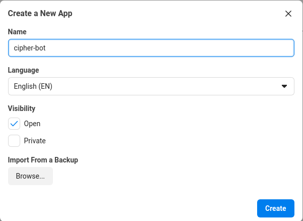
    </p>
    </details>

* We will be redirected to the understanding page where we will enter utterances or training data. And you'll notice that for every utterance we enter, we will need to specify the intent of that utterance (Or create the intent in case if it doesn't exist) And after every utterance click on **Train and Validate**.


    <details>
    <summary>Show Image</summary>
    <p align="center">
    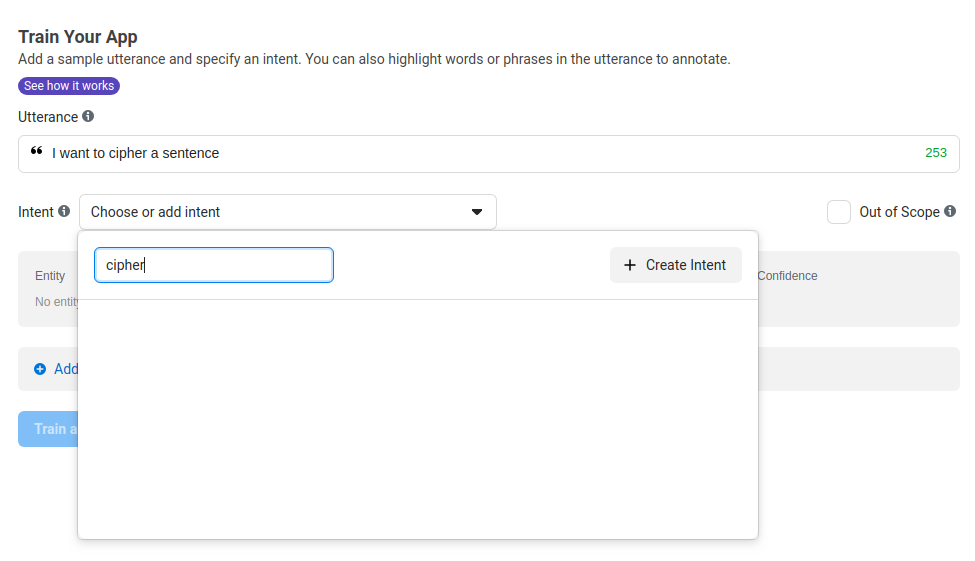
    </p>
    </details>


* You'll notice that over time Wit will automatically match the utterances that you enter with the correct intent and that indicates that we are on the right path.

    <details>
    <summary>Show Image</summary>
    <p align="center">
    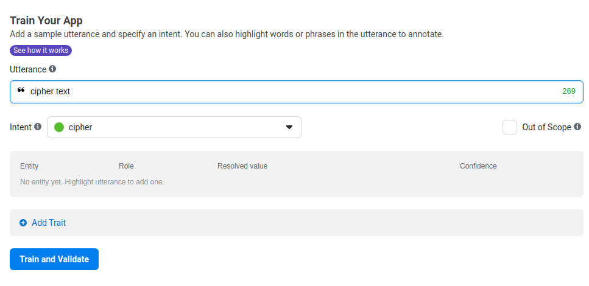
    </p>
    </details>


* We will keep entering data and creating intents. We will mainly use 6 intents:
    * `greeting`
    * `cipher`
    * `decipher`
    * `new_key`
    * `yes`
    * `no`

* We can find all the utterances in the utterances page.

* We can also test the Wit App using a curl request that is generated automatically by going to the **Settings** page

    <details>
    <summary>Show Image</summary>
    <p align="center">
    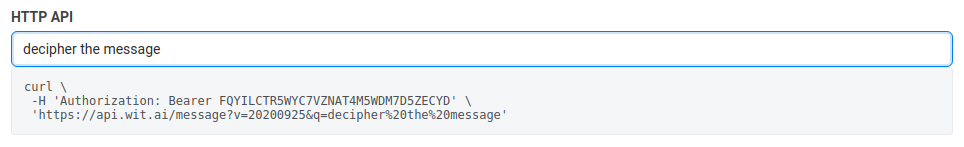
    </p>
    </details>


* And we can see that the response will contain the predicted intent and the confidence of the prediction

    ```json
    {
        "text": "decipher the message",
        "intents": [{
            "id": "935018250326137",
            "name": "decipher",
            "confidence": 0.9883
        }],
        "entities": {

        },
        "traits": {

        }
    }
    ```

* In the same page we can get the **Server Access Token** as we will use it later when we build the app

    <details>
    <summary>Show Image</summary>
    <p align="center">
    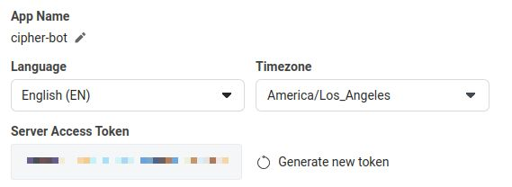
    </p>
    </details>

---

## <a name='CreateaFacebookPageandFacebookApptohostthechatbot'></a>Create Facebook Messenger Channel

For this part, we are going to create two things:

### <a name='FacebookPage'></a>Facebook Page

* Go to this [page](https://www.facebook.com/pages/creation/?ref_type=comet_home) to start the process of creating the new page
* Then choose your page name and category and click on the create button (And yes, that's it. you now have a page)

    <details>
    <summary>Show Image</summary>
    <p align="center">
    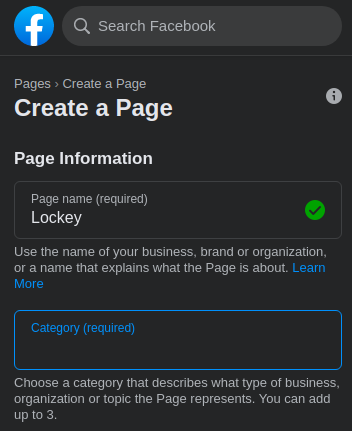
    </p>
    </details>

---

### <a name='FacebookApp'></a>Facebook App

* Go to [Facebook for Developers](https://developers.facebook.com/) and create an account if you don't have one and click on the **Create App** Button
* Choose **Manage Business Integrations**

    <details>
    <summary>Show Image</summary>
    <p align="center">
    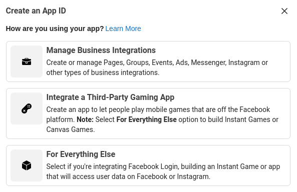
    </p>
    </details>

* Fill the required information and click on the **Create App ID**

    <details>
    <summary>Show Image</summary>
    <p align="center">
    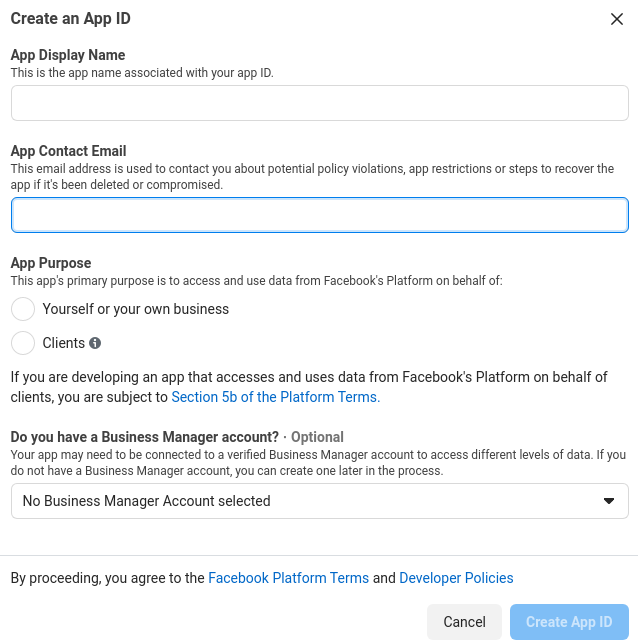
    </p>
    </details>

* Then from the list of products shown, Click on **Set Up** on the Messenger card

    <details>
    <summary>Show Image</summary>
    <p align="center">
    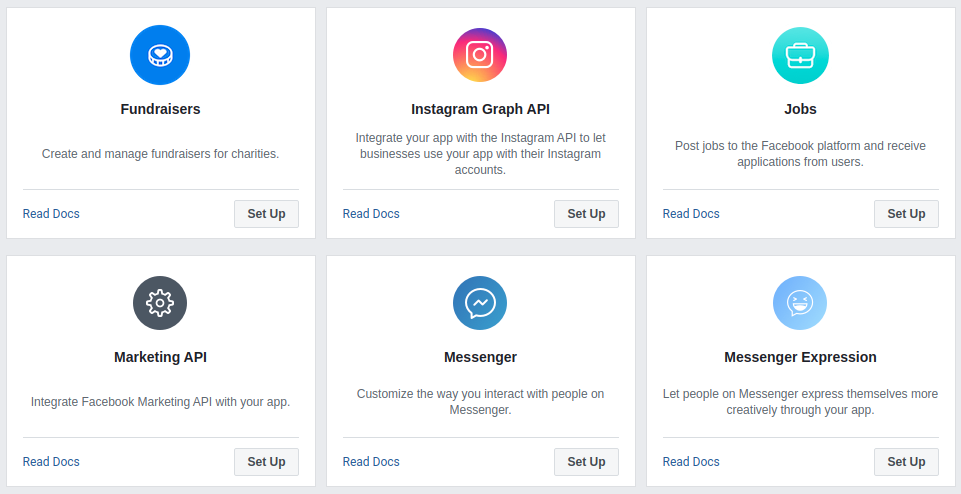
    </p>
    </details>

* In the **Access Tokens** Section, Click on the **Add or Remove Pages** Button and choose the page that we created earlier and agree on the permissions needed.

    <details>
    <summary>Show Image</summary>
    <p align="center">
    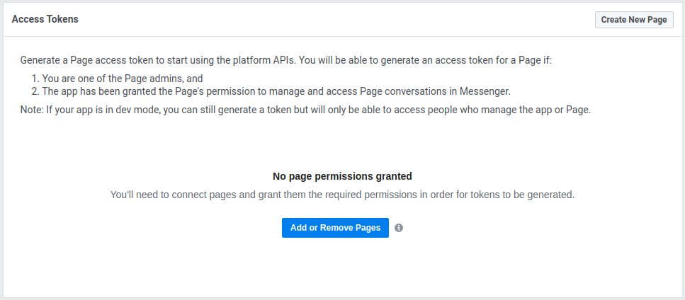
    </p>
    </details>

* Then click on the **Generate Token** Button and keep the generated token safe as we will use it later.

    <details>
    <summary>Show Image</summary>
    <p align="center">
    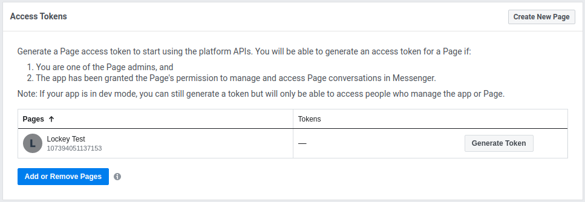
    </p>
    </details>

---

## <a name='CreateWebApplicationusingFastAPIandIntegratewithMessengerandWit'></a>Code Ninja Mode 

This section illustrates how you can use this repo to build the chatbot on your own page. You can find the source code in this [repo](https://github.com/Ahmed0Sultan/cipher-chatbot) so download it and follow these steps.

<p align="center">

</p>

### <a name='CloneProjectRepository'></a>Clone Project

```
$ git clone https://github.com/Ahmed0Sultan/cipher-chatbot.git
$ cd cipher-chatbot
```

### <a name='Thisisatreethatdemonstratesthefilesanddirectoriesintheproject.'></a>Project Structure

Here you can find the structure of the project.

```
└── cipher-chatbot
    ├── api
    │   ├── api.py
    │   └── endpoints
    │       └── facebook.py
    ├── connector
    │   └── facebook
    │       ├── bot.py
    │       └── utils.py
    ├── core
    │   ├── db
    │   │   ├── crud.py
    │   │   ├── database.py
    │   │   └── models.py
    │   ├── dialog
    │   │   ├── actions.py
    │   │   ├── manager.py
    │   │   └── responses.py
    │   └── nlp
    │       └── engine.py
    ├── LICENSE
    ├── main.py
    ├── README.md
    ├── requirements.txt
    └── variables.py
```

### <a name='CreateandActivateaVirtualEnvironment'></a>Virtual Environment
Create a virtual environment to start installing the project requiremnets in an isolated environment.

```
$ python -m venv venv
$ source ./venv/bin/activate
```

### <a name='InstallRequirements'></a>Install Requirements

Here you will install the project requirements.

```
$ pip install -r requirements.txt
```

### <a name='SetEnvironmentVariables'></a>Environment Variables
Create a new file named `.env` which will contain the secret tokens that we will use to integrate with Wit and Messenger (That we have already got in earlier steps)

```env
FB_PAGE_ACCESS_TOKEN="Very_Secret_Token"
FB_VERIFY_TOKEN="Very_Secret_Token"
WIT_SERVER_TOKEN="Very_Secret_Token"
```
---
### <a name='IntroductiontoFernet'></a>Introduction to Fernet
So Fernet is a system for symmetric encryption/decryption. It also authenticates the message, which means that the recipient can tell if the message has been altered in any way from what was originally sent.

And we can find examples to use it below

#### <a name='Createakey'></a>Create a key
```python
from cryptography.fernet import Fernet

key = Fernet.generate_key()
```
#### <a name='Encryptingamessage'></a>Encrypting a message
```python
cipher = Fernet(key)

message = "Very Secret Message".encode('utf-8')
encrypted_message = cipher.encrypt(message)
```
#### <a name='Decryptingamessage'></a>Decrypting a message
```python
cipher = Fernet(key)

decrypted_message = cipher.decrypt(encrypted_message)
```

---

### <a name='ExploretheDBModelsinOurApp'></a>DB Models

In [`core/db/database.py`](https://github.com/Ahmed0Sultan/cipher-chatbot/blob/master/core/db/database.py), We can find that we created an instance of the DB and then create a session that will be used to do all the CRUD operations needed.

```python
from sqlalchemy import create_engine
from sqlalchemy.ext.declarative import declarative_base
from sqlalchemy.orm import sessionmaker

SQLALCHEMY_DATABASE_URL = "sqlite:///./cipher_bot.db"

engine = create_engine(
    SQLALCHEMY_DATABASE_URL, connect_args={"check_same_thread": False}
)
SessionLocal = sessionmaker(autocommit=False, autoflush=False, bind=engine)

Base = declarative_base()
```

Then in [`core/db/models.py`](https://github.com/Ahmed0Sultan/cipher-chatbot/blob/master/core/db/models.py), We will find the models that will be used through the app which will be translated into database tables.

```python
from sqlalchemy import Boolean, Column, ForeignKey, Integer, String
from sqlalchemy.orm import relationship
from cryptography.fernet import Fernet

from core.db.database import Base


class User(Base):
    __tablename__ = "users"

    fb_id = Column(String, primary_key=True, unique=True, index=True)
    last_intent = Column(String)
    state = Column(String)
    last_used_key = Column(String)

    keys = relationship("Key", back_populates="owner")


class Key(Base):
    __tablename__ = "keys"

    id = Column(Integer, primary_key=True, index=True)
    key = Column(String, default=Fernet.generate_key().decode())
    owner_id = Column(Integer, ForeignKey("users.fb_id"))

    owner = relationship("User", back_populates="keys")
```
So here we have two models ([`User`](https://github.com/Ahmed0Sultan/cipher-chatbot/blob/f10bf2d047ba1463b767547d5894815b0f55a261/core/db/models.py#L8), [`Key`](https://github.com/Ahmed0Sultan/cipher-chatbot/blob/f10bf2d047ba1463b767547d5894815b0f55a261/core/db/models.py#L19)). 
* [`User`](https://github.com/Ahmed0Sultan/cipher-chatbot/blob/f10bf2d047ba1463b767547d5894815b0f55a261/core/db/models.py#L8) Model
  * We can see that we use the `fb_id` as a primary key where we will save the ID of the user that we get from the Messenger API
  * `last_intent` will contain the last intent identified by Wit so that we can handle the context of the conversation
  * `state` will contain a predefined state that we will later map to a specific action
  * `last_used_key` will contain the last key that was used by the user to make it easy for the user to reuse a key that was generated before
* [`Key`](https://github.com/Ahmed0Sultan/cipher-chatbot/blob/f10bf2d047ba1463b767547d5894815b0f55a261/core/db/models.py#L19) Model
  * `id` will contain an auto-generated primary key 
  * `key` will contain the key that was generated to encrypt and decrypt and its default value will be a key generated as illustrated above
  *  `owner_id` a foreign key that will link the key generated to the user by using the `fb_id`

And in [`core/db/crud.py`](https://github.com/Ahmed0Sultan/cipher-chatbot/blob/master/core/db/crud.py) we will find all the CRUD (Create, Read, Update, Delete) operations that we are going to use like (creating a new user, checking if the user exists, creating a new key, or updating a user state)

---

### <a name='UsingWit.aiinOurApp'></a>Wit Integration
In [`core/nlp`](https://github.com/Ahmed0Sultan/cipher-chatbot/tree/master/core/nlp) directory, We can find the [`engine.py`](https://github.com/Ahmed0Sultan/cipher-chatbot/blob/master/core/nlp/engine.py) file as below
```python
from wit import Wit

from variables import WIT_SERVER_TOKEN

class NLPEngine:
    def __init__(self):
        self.engine = Wit(WIT_SERVER_TOKEN)

    def predict(self, message):
        response = self.engine.message(message)
        try:
            intent = response["intents"][0]["name"]
        except:
            intent = "fallback"

        return intent
```
In this file, we create a class where we initialize an instance of the `Wit` class with a server token that we get from the environment variables. Then we create a prediction function which takes a text message as an input and we try to extract the recognized intent from the response or return the fallback intent in the of nothing found

---

### <a name='UsingMessengerAPIsinOurApp'></a>Messenger Integration
To handle sending messages and other Messenger API calls, we use the code in [Pymessenger](https://github.com/davidchua/pymessenger) library and modify it to have additional functionalities like sending messages with quick replies. You can find the modified code in [`connector/facebook/bot.py`](https://github.com/Ahmed0Sultan/cipher-chatbot/blob/master/connector/facebook/bot.py) and the [Messenger API Docs](https://developers.facebook.com/docs/messenger-platform).

In this part we will see how we can send different types of messages using Messenger API. For this, we have the [Send API](https://developers.facebook.com/docs/messenger-platform/reference/send-api/) which we will use to send different types of messages to our users.

The Base URL that we use for this is `https://graph.facebook.com/v9.0/me/messages?access_token=<PAGE_ACCESS_TOKEN>`, where we will replace the `<PAGE_ACCESS_TOKEN>` with the token that we generated from our page.

Now we will see the different types of messages and how we used them in the code. We will list the popular ones that we are using in this tutorial:

* Actions
    * Mark Seen
    * Typing On
    * Typing Off
* Messages
    * Text
    * Quick Replies
    * Template
        * Generic Template
        * Button Template

Because all the different types use the same API, we will create two functions that are ready to send any type of message.

* [Send Raw](https://github.com/Ahmed0Sultan/cipher-chatbot/blob/afc0419dcbfa20e2d6b1181bf24a987e9377dc78/connector/facebook/bot.py#L258)

    This function takes a payload as an input and sends a request with this payload to the **Send API**
    ```python
    def send_raw(self, payload):
        request_endpoint = 'https://graph.facebook.com/v9.0/me/messages'
        response = requests.post(
            request_endpoint,
            params=self.auth_args,
            json=payload
        )
        result = response.json()
        return result
    ```
* [Send Recipient](https://github.com/Ahmed0Sultan/cipher-chatbot/blob/afc0419dcbfa20e2d6b1181bf24a987e9377dc78/connector/facebook/bot.py#L41)

    This function takes a payload and the recipient user id as inputs, then adds the recipient user id in the payload, and calls the [`send_raw`](https://github.com/Ahmed0Sultan/cipher-chatbot/blob/afc0419dcbfa20e2d6b1181bf24a987e9377dc78/connector/facebook/bot.py#L258) function to send the payload.
    ```python
    def send_recipient(self, recipient_id, payload):
        payload['recipient'] = {
            'id': recipient_id
        }
        return self.send_raw(payload)
    ```

<details>
<summary>Send Actions</summary>

Great!! Now we need to know the payload of the action that we want to send. We can find it in the [Send API](https://developers.facebook.com/docs/messenger-platform/reference/send-api/#properties) As well, where the `<PSID>` is the recipient user id, and `<MESSAGING_TYPE>` is the type of the message that we are sending. You can read more about the different types of messages [here](https://developers.facebook.com/docs/messenger-platform/send-messages/#messaging_types).
```json
{
  "messaging_type": "<MESSAGING_TYPE>",
  "recipient": {
    "id": "<PSID>"
  },
  "sender_action": "mark_seen"
}
```
Now it would be easy to use the base functions we created to send an action.

```python
def send_action(self, recipient_id, action):
    return self.send_recipient(recipient_id, {
        'sender_action': action
    })
```

</details>

<details>
<summary>Send Messages</summary>

In the case of sending messages, we will add another [helper function](https://github.com/Ahmed0Sultan/cipher-chatbot/blob/afc0419dcbfa20e2d6b1181bf24a987e9377dc78/connector/facebook/bot.py#L49)
Which basically calls the `Mark Seen` and `Typing On` actions before sending a message, and a `Typing Off` action after sending the message to give the user a sense of reality while talking to the chatbot.

```python
def send_message(self, recipient_id, message):
    self.send_action(
        recipient_id=recipient_id,
        action='mark_seen'
    )

    self.send_action(
        recipient_id=recipient_id,
        action='typing_on'
    )

    message_req = self.send_recipient(recipient_id, {
        'message': message
    })

    self.send_action(
        recipient_id=recipient_id,
        action='typing_off'
    )
    return message_req
```

Now we will see how we can implement the different types of messages.

* Text Message
    Here's an example of a payload that sends a simple "Let's win this" message to the user
    ```json
    {
        "messaging_type": "<MESSAGING_TYPE>",
        "recipient": {
            "id": "<PSID>"
        },
        "message": {
            "text": "Let's win this"
        }
    }
    ```
    So we can create a [function](https://github.com/Ahmed0Sultan/cipher-chatbot/blob/afc0419dcbfa20e2d6b1181bf24a987e9377dc78/connector/facebook/bot.py#L91) that sends a text message like that:
    ```python
    def send_text_message(self, recipient_id, message):
        return self.send_message(recipient_id, {
            'text': message
        })
    ```

* Quick Replies Message
    Here's an example of a payload that sends quick replies to the user
    ```json
    {
        "recipient":{
            "id":"<PSID>"
        },
        "messaging_type": "RESPONSE",
        "message":{
            "text": "Pick a color:",
            "quick_replies":[
                {
                    "content_type":"text",
                    "title":"Red",
                    "payload":"<POSTBACK_PAYLOAD>",
                    "image_url":"http://example.com/img/red.png"
                },{
                    "content_type":"text",
                    "title":"Green",
                    "payload":"<POSTBACK_PAYLOAD>",
                    "image_url":"http://example.com/img/green.png"
                }
            ]
        }
    }
    ```

    And we can create a [function](https://github.com/Ahmed0Sultan/cipher-chatbot/blob/afc0419dcbfa20e2d6b1181bf24a987e9377dc78/connector/facebook/bot.py#L347) that sends a message like that:

    ```python
    def send_quick_replies(self, recipient_id, message, quick_replies):
        return self.send_message(recipient_id, {
            "text": message,
            "quick_replies": quick_replies
        })
    ```

* Generic Template Message
    Here's an example of a payload that sends a card or a carousel of cards to the user
    ```json
    {
        "recipient":{
            "id":"<PSID>"
        },
        "message":{
            "attachment":{
                "type":"template",
                "payload":{
                    "template_type":"generic",
                    "elements":[
                        {
                            "title":"Welcome!",
                            "image_url":"https://petersfancybrownhats.com/company_image.png",
                            "subtitle":"We have the right hat for everyone.",
                            "buttons":[
                                {
                                    "type":"web_url",
                                    "url":"https://petersfancybrownhats.com",
                                    "title":"View Website"
                                },{
                                    "type":"postback",
                                    "title":"Start Chatting",
                                    "payload":"DEVELOPER_DEFINED_PAYLOAD"
                                }              
                            ]      
                        }
                    ]
                }
            }
        }
    }
    ```
    So we can create a [function](https://github.com/Ahmed0Sultan/cipher-chatbot/blob/afc0419dcbfa20e2d6b1181bf24a987e9377dc78/connector/facebook/bot.py#L106) that sends a message like that:
    ```python
    def send_generic_message(self, recipient_id, elements):
        return self.send_message(recipient_id, {
            "attachment": {
                "type": "template",
                "payload": {
                    "template_type": "generic",
                    "elements": elements
                }
            }
        })
    ```

</details>

And that's how we use the Send API.

<p align="center">

</p>

---

### <a name='DialogManagement'></a>Dialog Management

There is a very important concept we should introduce here named `State`. So every step in the conversation that users will have should be categorized into a state category. To make it easy, here is a table that have the states used in the tutorial.

| State                | Description                                                                                                         |
|----------------------|---------------------------------------------------------------------------------------------------------------------|
| CONTINUE             | This is the normal state where we use wit.ai to understand the text.                                                |
| WAIT_MESSAGE_CIPHER  | This state is triggered when the user wants to cipher a message so the next input is expected to be that message.   |
| WAIT_MESSAGE_DECIFER | This state is triggered when the user wants to decipher a message so the next input is expected to be that message. |
| WAIT_KEY             | This state is triggered as the user is expected to enter his decipher key.                                          |

In [`core/dialog`](https://github.com/Ahmed0Sultan/cipher-chatbot/tree/master/core/dialog) directory we will find two files:


* [`actions.py`](https://github.com/Ahmed0Sultan/cipher-chatbot/blob/master/core/dialog/actions.py)

    In this file, We will create the functions that will trigger the CRUD operations function in [`core/db/crud.py`](https://github.com/Ahmed0Sultan/cipher-chatbot/blob/master/core/db/crud.py) file, and will also trigger the Messenger API functions in [`connector/facebook/bot.py`](https://github.com/Ahmed0Sultan/cipher-chatbot/blob/master/connector/facebook/bot.py). So let's go through them quickly.

    * [`pre_cipher`](https://github.com/Ahmed0Sultan/cipher-chatbot/blob/afc0419dcbfa20e2d6b1181bf24a987e9377dc78/core/dialog/actions.py#L12)
        
        This function checks, if the user already have a key, he will be asked if he wants to use it or generate a new one. If not, a new key will be generated for him and he will be asked to enter the message he wants to cipher or encrypt. and also changes the user state to `WAIT_MESSAGE_CIPHER`

        <details>
        <summary>Show Code</summary>

        ```python
        def pre_cipher(recipient_id, db):
            user = crud.get_user(db, recipient_id)
            key, key_state = crud.get_user_key(db, recipient_id)
            if key_state == "NEW":
                fb_bot.send_text_message(
                    recipient_id,
                    "I have created a new key. Keep it Safe!!"
                )
                fb_bot.send_text_message(
                    recipient_id,
                    key
                )
                fb_bot.send_text_message(
                    recipient_id,
                    "Now enter the message that you want to keep it safe."
                )
                crud.update_user_state(db, recipient_id, "WAIT_MESSAGE_CIPHER")
            elif key_state == "OLD":
                fb_bot.send_quick_replies(
                recipient_id,
                "It seems that you have an already generated key, Do you want to keep using it?",
                [
                    {
                        "content_type": 'text',
                        "title": 'Yes',
                        "payload": 'yes'
                    },
                    {
                        "content_type": 'text',
                        "title": 'No',
                        "payload": 'no'
                    }
                ]
            )
                crud.update_user_last_intent(db, recipient_id, "CONFIRM_USING_OLD_KEY")
        ```

        </details>
    
    * [`reset_user_state`](https://github.com/Ahmed0Sultan/cipher-chatbot/blob/afc0419dcbfa20e2d6b1181bf24a987e9377dc78/core/dialog/actions.py#L48)
        
        This function resets the user state to the normal one which is `CONTINUE`

        <details>
        <summary>Show Code</summary>

        ```python
        def reset_user_state(recipient_id, db):
            crud.update_user_state(db, recipient_id, "CONTINUE")
        ```

        </details>
    
    * [`generate_key`](https://github.com/Ahmed0Sultan/cipher-chatbot/blob/afc0419dcbfa20e2d6b1181bf24a987e9377dc78/core/dialog/actions.py#L57)
        
        This function generates a new key for the user and change his state to `WAIT_MESSAGE_CIPHER`

        <details>
        <summary>Show Code</summary>

        ```python
        def generate_key(recipient_id, db):
            user = crud.get_user(db, recipient_id)
            key = crud.create_user_key(db, recipient_id)
            fb_bot.send_text_message(
                recipient_id,
                "I have created a new key. Keep it Safe!!"
            )
            fb_bot.send_text_message(
                recipient_id,
                key.key
            )
            fb_bot.send_text_message(
                recipient_id,
                "Now enter the message that you want to keep it safe."
            )
            crud.update_user_state(db, recipient_id, "WAIT_MESSAGE_CIPHER")
        ```

        </details>
    
    * [`confirm_pre_cipher`](https://github.com/Ahmed0Sultan/cipher-chatbot/blob/afc0419dcbfa20e2d6b1181bf24a987e9377dc78/core/dialog/actions.py#L74)
        
        This function asks the user to enter the message he wants to cipher and change his state to `WAIT_MESSAGE_DECIFER`

        <details>
        <summary>Show Code</summary>

        ```python
        def confirm_pre_cipher(recipient_id, db):
            user = crud.get_user(db, recipient_id)
            fb_bot.send_text_message(
                recipient_id,
                "Great. Now enter the message that you want to keep safe."
            )
            crud.update_user_state(db, recipient_id, "WAIT_MESSAGE_CIPHER")
        ```

        </details>
    
    * [`cipher`](https://github.com/Ahmed0Sultan/cipher-chatbot/blob/afc0419dcbfa20e2d6b1181bf24a987e9377dc78/core/dialog/actions.py#L89)
        
        This function encrypts a message and sends it to the user. It also asks him if he wants to encrypt anything else, and change the last intent to `CONFIRM_CIPHER_AGAIN` and the state to `CONTINUE`

        <details>
        <summary>Show Code</summary>

        ```python
        def cipher(message, recipient_id, db):
            key, _ = crud.get_user_key(db, recipient_id)
            key = key.encode()
            message = message.encode()
            f = Fernet(key)
            encrypted_message = f.encrypt(message).decode()
            fb_bot.send_text_message(
                recipient_id,
                "This is the encrypted message. It'll only be decrypted using the key that you used"
            )
            fb_bot.send_text_message(
                recipient_id,
                encrypted_message
            )
            fb_bot.send_quick_replies(
                recipient_id,
                "Do you want to encrypt anything else?",
                [
                    {
                        "content_type": 'text',
                        "title": 'Yes',
                        "payload": 'yes'
                    },
                    {
                        "content_type": 'text',
                        "title": 'No',
                        "payload": 'no'
                    }
                ]
            )
            crud.update_user_last_intent(db, recipient_id, "CONFIRM_CIPHER_AGAIN")
            crud.update_user_state(db, recipient_id, "CONTINUE")
        ```

        </details>
    
    * [`pre_decipher_key`](https://github.com/Ahmed0Sultan/cipher-chatbot/blob/afc0419dcbfa20e2d6b1181bf24a987e9377dc78/core/dialog/actions.py#L122)
        
        This function asks the user to enter his key that will be used to decrypt messages and changes the user state to `WAIT_KEY`

        <details>
        <summary>Show Code</summary>

        ```python
        def pre_decipher_key(recipient_id, db):
            user = crud.get_user(db, recipient_id)
            fb_bot.send_text_message(
                recipient_id,
                "Please enter the key that has been shared with you to decrypt the message"
            )
            crud.update_user_state(db, recipient_id, "WAIT_KEY")
        ```

        </details>
    
    * [`pre_decipher_message`](https://github.com/Ahmed0Sultan/cipher-chatbot/blob/afc0419dcbfa20e2d6b1181bf24a987e9377dc78/core/dialog/actions.py#L130)
        
        This function saves the decryption key and asks the user to enter his message and change the state to `WAIT_MESSAGE_DECIFER`

        <details>
        <summary>Show Code</summary>

        ```python
        def pre_decipher_message(message, recipient_id, db):
            user = crud.get_user(db, recipient_id)
            try:
                crud.update_user_last_used_key(db, recipient_id, message)
                fb_bot.send_text_message(
                    recipient_id,
                    "Now enter the message that you want to decrypt."
                )
                crud.update_user_state(db, recipient_id, "WAIT_MESSAGE_DECIFER")
            except Exception:
                fb_bot.send_text_message(
                    recipient_id,
                    "The key you've entered is not valid. Please make sure you have the correct key"
                )
        ```

        </details>
    
    * [`decipher`](https://github.com/Ahmed0Sultan/cipher-chatbot/blob/afc0419dcbfa20e2d6b1181bf24a987e9377dc78/core/dialog/actions.py#L145)
        
        This function decrypts a message and sends it to the user. It also asks him if he wants to decrypt anything else, and change the last intent to `CONFIRM_DECIPHER_AGAIN` and the state to `CONTINUE`

        <details>
        <summary>Show Code</summary>

        ```python
        def decipher(message, recipient_id, db):
            try:
                user = crud.get_user(db, recipient_id)
                key = user.last_used_key
                key = key.encode()
                message = message.encode()
                f = Fernet(key)
                decrypted_message = f.decrypt(message)
                fb_bot.send_text_message(
                    recipient_id,
                    "This is the decrypted message. Keep it safe and delete after you read it."
                )
                fb_bot.send_text_message(
                    recipient_id,
                    decrypted_message.decode()
                )
                fb_bot.send_quick_replies(
                recipient_id,
                "Do you want to decrypt anything else?",
                [
                    {
                        "content_type": 'text',
                        "title": 'Yes',
                        "payload": 'yes'
                    },
                    {
                        "content_type": 'text',
                        "title": 'No',
                        "payload": 'no'
                    }
                ]
            )
                crud.update_user_last_intent(db, recipient_id, "CONFIRM_DECIPHER_AGAIN")
                crud.update_user_state(db, recipient_id, "CONTINUE")
            except Exception:
                fb_bot.send_text_message(
                    recipient_id,
                    "The encrypted message you've entered is not valid. Please make sure you have the correct message"
                )
        ```

        </details>

---

* [`manager.py`](https://github.com/Ahmed0Sultan/cipher-chatbot/blob/master/core/dialog/manager.py)

    In this file, We will trigger the actions that we created based on the user current state, last intent, and the current intent identified by Wit. Let's go through them.

    * [`process_message`](https://github.com/Ahmed0Sultan/cipher-chatbot/blob/afc0419dcbfa20e2d6b1181bf24a987e9377dc78/core/dialog/manager.py#L12)

        This function checks the current user state and depending on it, it will route the user into the right conversation path.

    * [`get_response`](https://github.com/Ahmed0Sultan/cipher-chatbot/blob/afc0419dcbfa20e2d6b1181bf24a987e9377dc78/core/dialog/manager.py#L29)

        This function checks the current identified intent and depending on it and the last recorded intent, it will route the user into the right conversation path.

---

### <a name='OurAPIRoutes'></a>Endpoints
So for our application to send and recieve requests it has to have routes. We can find the routes of the app in the [`api`](https://github.com/Ahmed0Sultan/cipher-chatbot/tree/master/api) directory. Let's start with the [`api/endpoints/facebook.py`](https://github.com/Ahmed0Sultan/cipher-chatbot/blob/master/api/endpoints/facebook.py) file, which is the only route we have.
```python
@router.get('/facebook-webhook')
async def verify_token(token: str = Query(None, alias="hub.verify_token"),
 challenge: int = Query(None, alias="hub.challenge")):
    if token == FB_VERIFY_TOKEN:
        return challenge
    else:
        raise HTTPException(status_code=403, detail="Token invalid.")

@router.post('/facebook-webhook')
async def process_fb_requests(request: Request, db: Session = Depends(get_db)):
    output = await request.json()
    for event in output['entry']:
        messaging = event['messaging']
        for x in messaging:
            if x.get('message'):
                recipient_id = str(x['sender']['id'])
                if x['message'].get('text'):
                    message = x['message']['text']
                    dialog_manager.process_message(
                    message,
                    recipient_id,
                    db)

            elif x.get('postback'):
                recipient_id = str(x['sender']['id'])
                if x['postback'].get('title'):
                    message = x['postback']['title']
                    dialog_manager.process_message(message, 
                    recipient_id,
                    db)
    return "Success"
```
So the route name is `/facebook-webhook` and it has two methods:
* [`GET`](https://github.com/Ahmed0Sultan/cipher-chatbot/blob/f10bf2d047ba1463b767547d5894815b0f55a261/api/endpoints/facebook.py#L24)

    So the `GET` method is used to verify the bot’s token and thus connect the app with Facebook messenger. And this is done by checking if the [`hub.verify_token`](https://github.com/Ahmed0Sultan/cipher-chatbot/blob/b38d5fe6d0f4136ed0a3f89a1b843f7d845fc9a8/api/endpoints/facebook.py#L25) equals the `FB_VERIFY_TOKEN` that we have created in the `.env` file earlier. If they are equall to each other, then we will return the `hub.challenge` that was sent in the same request with a `200` status code. And if they are not equall to each other then we will return a `"Token Invalid"` message with a `403` status code and then the verification will fail.

    <details>
    <summary>Show Code</summary>

    ```python
    @router.get('/facebook-webhook')
    async def verify_token(token: str = Query(None, alias="hub.verify_token"),
    challenge: int = Query(None, alias="hub.challenge")):
        if token == FB_VERIFY_TOKEN:
            return challenge
        else:
            raise HTTPException(status_code=403, detail="Token invalid.")
    ```

    </details>

* [`POST`](https://github.com/Ahmed0Sultan/cipher-chatbot/blob/f10bf2d047ba1463b767547d5894815b0f55a261/api/endpoints/facebook.py#L32)

    The `POST` method is used by Facebook to send the messages that are sent by users to our web application. Multiple message can be sent in the same event so make sure that you iterate on the `entry` object as shown in the code snippist above. And we can find here that we handle two types of messages. Normal text [`message`](https://github.com/Ahmed0Sultan/cipher-chatbot/blob/b38d5fe6d0f4136ed0a3f89a1b843f7d845fc9a8/api/endpoints/facebook.py#L38) and a [`postback`](https://github.com/Ahmed0Sultan/cipher-chatbot/blob/b38d5fe6d0f4136ed0a3f89a1b843f7d845fc9a8/api/endpoints/facebook.py#L47) message. So let's see what happens for the two cases:

    * [`message`]()
        Here we recieve text messages or quick replies and in this tutorial we only use the text in the quick reply. You can read more about it in the official documentation [here](https://developers.facebook.com/docs/messenger-platform/reference/webhook-events/messages)
    
        <details>
        
        <summary>Show Example</summary>

        ```json
        {
            "object":"page",
            "entry":[
                {
                    "id":"<PAGE_ID>",
                    "time":1458692752478,
                    "messaging":[
                        {
                            "sender":{
                                "id":"<PSID>"
                            },
                            "recipient":{
                                "id":"<PAGE_ID>"
                            },
                            "timestamp":1458692752478,
                            "message":{
                                "mid":"mid.1457764197618:41d102a3e1ae206a38",
                                "text":"hello, world!",
                                "quick_reply": {
                                    "payload": "<DEVELOPER_DEFINED_PAYLOAD>"
                                }
                            }
                        }
                    ]
                }
            ]
        }
        ```

        </details>
    
    * [`postback`]()
        Here we recieve postbacks and in this tutorial we only use the title of the postback event. You can read more about it in the official documentation [here](https://developers.facebook.com/docs/messenger-platform/reference/webhook-events/messaging_postbacks)

        <details>
        <summary>Show Example</summary>

        ```json
        {
            "object":"page",
            "entry":[
                {
                    "id":"<PAGE_ID>",
                    "time":1458692752478,
                    "messaging":[
                        {
                            "sender":{
                                "id":"<PSID>"
                            },
                            "recipient":{
                                "id":"<PAGE_ID>"
                            },
                            "timestamp":1458692752478,
                            "postback":{
                                "title": "<TITLE_FOR_THE_CTA>",  
                                "payload": "<USER_DEFINED_PAYLOAD>",
                                "referral": {
                                    "ref": "<USER_DEFINED_REFERRAL_PARAM>",
                                    "source": "<SHORTLINK>",
                                    "type": "OPEN_THREAD",
                                }
                            }
                        }
                    ]
                }
            ]
        }
        ```

        </details>
    

Then we import all the routes (Which in our case is only one) into another file [`api/api.py`](https://github.com/Ahmed0Sultan/cipher-chatbot/blob/master/api/api.py) which in turn gathers all the available routes under one instance of the [`APIRouter`](https://github.com/Ahmed0Sultan/cipher-chatbot/blob/f10bf2d047ba1463b767547d5894815b0f55a261/api/api.py#L5) class.
```python
from fastapi import APIRouter

from api.endpoints import facebook

api_router = APIRouter()
api_router.include_router(facebook.router, tags=["verify_token"])
```

---

### <a name='OurApplicationEntryPoint'></a>Entrypoint
So After explaining the logic that resides in the application, let's explain how the app works.

We can find in the [`main.py`](https://github.com/Ahmed0Sultan/cipher-chatbot/blob/master/main.py) file that we initialize an instance of the [`FastAPI`](https://github.com/Ahmed0Sultan/cipher-chatbot/blob/f10bf2d047ba1463b767547d5894815b0f55a261/main.py#L5) class which we will use later to run the app. Then we will import the instance of [`APIRouter`](https://github.com/Ahmed0Sultan/cipher-chatbot/blob/f10bf2d047ba1463b767547d5894815b0f55a261/api/api.py#L5)  that we created before and added to our app.
```python
from fastapi import FastAPI

from api.api import api_router

app = FastAPI()

app.include_router(api_router)
```
---

### <a name='RunOurApp'></a>Run

To run the app just enter this command.
```sh
$ uvicorn main:app
```

<p align="center">

</p>

## <a name='DeploytheWebApplicationusingngrok'></a>Deployment
So we can find that our app works on `localhost:8000` and it only works for requests created on the same computer as the running server. So we need to let Facebook know how to reach the FastAPI server. This can be done using ngrok.

Let's go to the [ngrok download page](https://ngrok.com/download) and install the version suitable for our operating system

And then we run this command to expose the local port serving the web application.
```sh
$ ./ngrok http 8000
```

> Make sure that the FastAPI is up and running

We will copy the generated link (the one with https as Facebook requires the webhook to be secure). And note that this link expires after eight hours and changes every time you run the command.


<details>
<summary>Show Image</summary>
<p align="center">
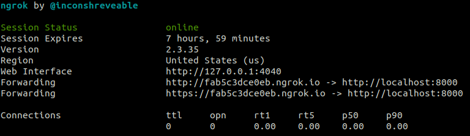
</p>
</details>

---

### <a name='SetupthewebhookintheFacebookApp'></a>Add Webhook

Back to [Facebook Developers](https://developers.facebook.com/), we can see the `Webhooks` section. Click on the `Add Callback URL`

<details>
<summary>Show Image</summary>
<p align="center">
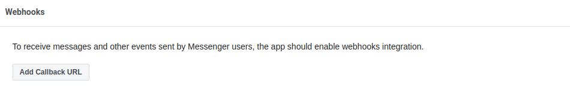
</p>
</details>

And then enter the URL generated by ngrok and the `Verify Token` which we created in the `.env` file so Facebook can verify our webhook.

<details>
<summary>Show Image</summary>
<p align="center">
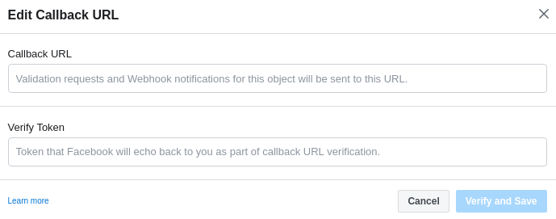
</p>
</details>

In the same `Webhooks` section, click the **Add Subscriptions** button and check the (`messages`, `messaging_postbacks`, `message_deliveries`) boxes and click **Save**

<details>
<summary>Show Image</summary>
<p align="center">
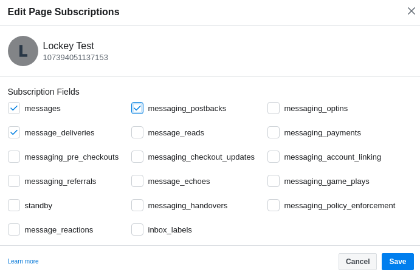
</p>
</details>

**Congratulations**, That's it. You can now go to the page you created and start sharing encrypted messages with your friends.

<p align="center">

</p>

---

## <a name='NextSteps'></a>Next Steps
Next, We will make the app voice-enabled using [Wit.ai](https://wit.ai), and add the option to share the keys and messages between users.

## <a name='Resources'></a>Resources

* [Wit Documentation](https://wit.ai/docs)
* [Messenger API Docs](https://developers.facebook.com/docs/messenger-platform)
* [FastAPI](https://fastapi.tiangolo.com/)


## <a name='License'></a>License
The tutorial and the source code are licensed, as found in the [LICENSE](https://github.com/Ahmed0Sultan/cipher-chatbot/blob/master/LICENSE) file.